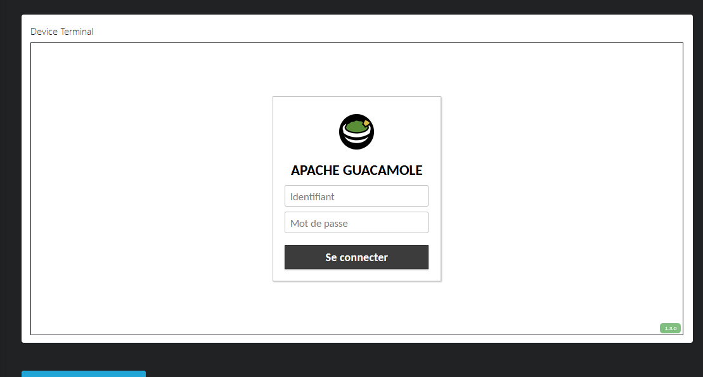
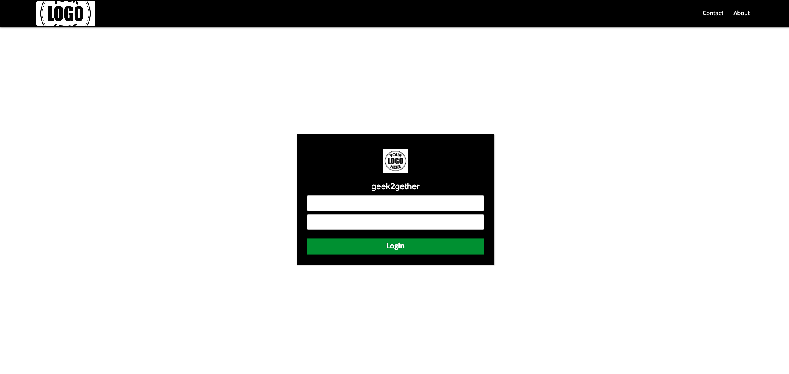

# Apache-Guacamole-Theme

The geek2gether-theme.jar file is a container type file like a .zip archive, which means it contains files. You should be able to use archive manager programs like 7-zip to open the .jar file and view/edit the files contained within it.

The internal file structure is basically:

css  -> contians the custom css file. Use this file to customize css.
html  -> contains custom html file, header.html which adss the header on the login page. (Can be removed if not needed.)
images  -> contains the logo file. logo file as .png, replace the template logo with your custom logo.
translations  -> en.json (file) and other language files as needed.
guac-manifest.json file which ties all the parts together so Guacamole knows what to use.

To use my theme, follow the steps below:

Step 1: clone or download the plugin geek2gether-theme.jar to your guacamole 

Step 2: move it to your guacamole root directory "extensions" folder.

Step 3: Restart guacd and tomcat.

Before guacamole theme:

After using my theme

Adding Custom CSS and HTML Files

CSS

The CSS files referenced in guac-manifest.json are appended to the application CSS when loaded, therefore they will override the CSS properties.

HTML modification
The existing HTML structure of Guacamole interface can be modified through special "patch" HTML files declared by the html property in guac-manifest.json. These files are HTML fragments and are identical to any other HTML file except that they contain Guacamole-specific meta tags that instruct Guacamole to modify its own HTML in a particular way. Each meta tag takes the following form:

<meta name="NAME" content="SELECTOR">

where SELECTOR is a CSS selector that matches the elements within the Guacamole interface that serve as a basis for the modification, and NAME is any one of the following defined modifications:

before
Inserts the specified HTML immediately before any element matching the CSS selector.

after
Inserts the specified HTML immediately after any element matching the CSS selector.

replace
Replaces any element matching the CSS selector with the specified HTML.

before-children
Inserts the specified HTML immediately before the first child (if any) of any element matching the CSS selector. If a matching element has no children, the HTML simply becomes the entire contents of the matching element.

after-children
Inserts the specified HTML immediately after the last child (if any) of any element matching the CSS selector. If a matching element has no children, the HTML simply becomes the entire contents of the matching element.

replace-children
Replaces the entire contents of any element matching the CSS selector with the specified HTML.
